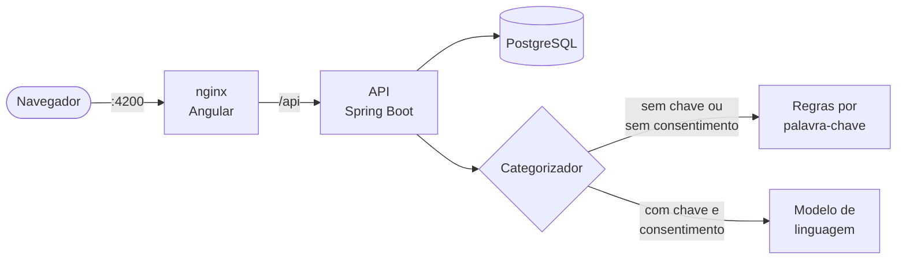

<div align="center">

# 💰 Cofre

**Controle financeiro pessoal com categorização automática de lançamentos por IA.**

Você lança o gasto, o Cofre descobre a categoria.

[](https://github.com/nicole21carvalho/cofre/actions/workflows/ci.yml)


[O que resolve](#-o-que-resolve) •
[Funcionalidades](#-funcionalidades) •
[Arquitetura](#-arquitetura) •
[Rodando](#-rodando) •
[Endpoints](#-endpoints) •
[Decisões](#-decisões-que-valem-explicar) •
[Privacidade](#-privacidade)

<br>


</div>

---

## 🎯 O que resolve

Anotar gasto é fácil; classificar gasto é o que ninguém faz. Sem categoria, o extrato vira uma lista sem significado e o usuário abandona o app na segunda semana. O Cofre tenta resolver isso lançando primeiro e perguntando depois: ao salvar uma transação sem categoria, a API sugere uma a partir da descrição.

A sugestão tem duas implementações por trás da mesma interface `Categorizador`. Sem chave de API configurada, roda um classificador por palavra-chave que resolve os casos óbvios e custa zero. Com chave, roda um modelo de linguagem que lida com descrições que regra não pega — `PG *MERC BOM PRECO 04` não contém a palavra "mercado".

Isso é decisão de projeto, não indecisão: a aplicação precisa subir e funcionar na máquina de quem clonou o repositório, sem credencial nenhuma. E a versão por regras serve de linha de base — sem ela não dá para afirmar que o modelo melhora alguma coisa.

A resposta do modelo nunca é gravada direto. Ela é validada contra as categorias que o usuário já tem, e qualquer falha de rede devolve "sem sugestão" em vez de erro: categorização é extra, o lançamento precisa salvar de qualquer jeito.

## ✨ Funcionalidades

- 🏷️ **Categorização automática** — por regras locais ou por modelo de linguagem, com a marca *sugerido* no extrato
- ✏️ **Correção manual** — trocar a categoria desmarca a sugestão da IA
- 📊 **Resumo do mês** — receitas, despesas, saldo e gasto por categoria
- 🔐 **Autenticação JWT** com limite de tentativas no login
- 🛡️ **Consentimento LGPD** — nada sai da aplicação sem o usuário permitir
- 📱 **Responsivo** — funciona no celular

<div align="center">
<table>
  <tr>
    <td align="center"><br><sub>Login</sub></td>
    <td align="center"><br><sub>Celular</sub></td>
  </tr>
</table>
</div>

## 🧱 Stack

| Camada | Tecnologias |
| --- | --- |
| **Front-end** | Angular 22 · TypeScript · RxJS · Signals |
| **Back-end** | Java 21 · Spring Boot 4.1 · Spring Security · JPA |
| **Dados** | PostgreSQL 16 · Flyway |
| **Infra** | Docker · Docker Compose · nginx · GitHub Actions |

## 🏗️ Arquitetura



A API não é publicada no host: todo acesso passa pelo nginx, que é quem informa à API o IP real do cliente para o limite de tentativas do login.

## 🚀 Rodando

Com Docker, sobe tudo:

```bash
git clone https://github.com/nicole21carvalho/cofre.git
cd cofre
cp .env.example .env
# Preencha no .env:
#   COFRE_JWT_SECRET, por exemplo com: openssl rand -base64 48
#   DB_PASSWORD,      por exemplo com: openssl rand -hex 24
docker compose up --build
```

A interface fica em `http://localhost:4200`, e a API responde no mesmo endereço, em `http://localhost:4200/api`.

<details>
<summary><b>Só a API, sem Docker (H2 em memória)</b></summary>

```bash
cd backend
export COFRE_JWT_SECRET="$(openssl rand -base64 48)"
mvn spring-boot:run
```

</details>

> [!IMPORTANT]
> A chave do JWT não tem valor padrão de propósito: sem `COFRE_JWT_SECRET` (mínimo de 32 bytes), a API se recusa a subir. Um padrão no código seria uma chave pública, e com ela qualquer pessoa assinaria tokens válidos.

> [!TIP]
> Para ativar a categorização por modelo, preencha `COFRE_IA_API_KEY` no `.env`. Sem isso, o classificador por regras assume.

## 🔌 Endpoints

| Método | Rota | O que faz |
| --- | --- | --- |
| `POST` | `/api/auth/cadastro` | Cria conta e já semeia categorias padrão |
| `POST` | `/api/auth/login` | Devolve o JWT |
| `GET` | `/api/transacoes` | Extrato paginado, filtro opcional por período |
| `POST` | `/api/transacoes` | Lança; sem `categoriaId`, pede sugestão |
| `PUT` | `/api/transacoes/{id}` | Edita; corrigir a categoria desmarca a flag de IA |
| `DELETE` | `/api/transacoes/{id}` | Remove |
| `GET` | `/api/transacoes/resumo` | Receitas, despesas, saldo e gasto por categoria |
| `GET` | `/api/categorias` | Lista as do usuário |
| `GET` | `/api/privacidade` | Diz se há IA configurada e se o usuário consentiu |
| `PUT` | `/api/privacidade/consentimento-ia` | Concede (`{"aceito": true}`) ou revoga o consentimento |

Todas as rotas abaixo de `/api`, exceto cadastro e login, exigem `Authorization: Bearer <token>`.

## 🧠 Decisões que valem explicar

**JWT em vez de sessão.** Sessão exige estado no servidor, e com mais de uma instância atrás de um balanceador cada requisição pode cair numa instância que não a conhece. O custo é não conseguir invalidar um token antes da hora — por isso a expiração é curta.

**O id do dono vem do token, nunca do corpo da requisição.** Se viesse do corpo, trocar um número bastaria para ler o extrato de outra pessoa. Todo método de repositório filtra por `usuario_id`.

**`BigDecimal` para dinheiro.** `double` acumula erro de arredondamento e vira divergência de centavos no fechamento.

**Flyway em vez de `ddl-auto: update`.** Schema versionado em arquivo é schema que dá para revisar em pull request e reproduzir em qualquer ambiente.

**CI com dependências travadas.** As actions são fixadas por SHA do commit, não por tag, e o pipeline roda testes, build e varredura de vulnerabilidades conhecidas (osv-scanner) antes de construir as imagens.

## 🔒 Privacidade

Com a categorização por modelo configurada, a descrição dos lançamentos sem categoria e os nomes das categorias do usuário vão para um serviço externo. Por isso o envio depende de consentimento explícito de cada usuário (LGPD, art. 7º, I):

- Ninguém começa consentindo. Até o usuário clicar em **Permitir** no painel, a sugestão vem das regras locais e nada sai da aplicação.
- O aviso diz o que é enviado, o que não é (valor, data, dados da conta) e para quem (`cofre.ia.provedor`).
- A data do consentimento fica gravada (`usuario.consentimento_ia_em`), porque cabe ao controlador provar que ele foi dado (art. 8º, §2º).
- Desativar fica no mesmo lugar e com o mesmo destaque que permitir (art. 8º, §5º). Depois disso, nenhuma descrição nova é enviada.

Sem chave de IA configurada, o modo por regras roda sozinho, não envia nada para fora e o painel nem mostra o pedido.

Isso cobre o consentimento na aplicação. Em uso real ainda faltariam a política de privacidade e a avaliação do contrato com o provedor, que tratam do que ele faz com os dados recebidos.

<!--
## 📚 O que aprendi

Preencher depois de rodar — esta seção é a que separa portfólio de pasta. Vale descrever o que quebrou de verdade: a ordem de subida dos containers, o Flyway reclamando do schema, o CORS no primeiro request do Angular.
-->

---

<div align="center">

Feito por **Nicole de Carvalho** · [GitHub](https://github.com/nicole21carvalho)

</div>
